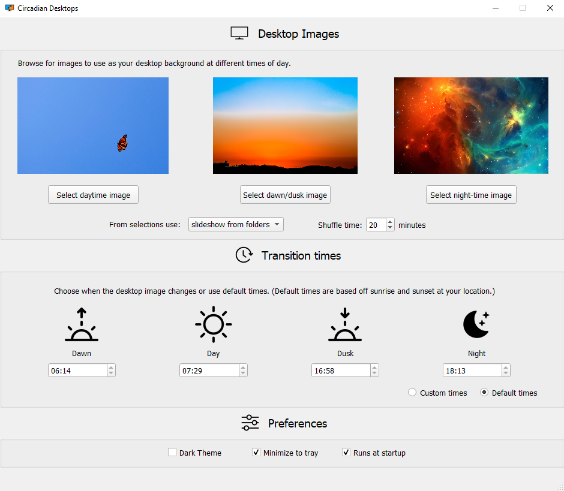

# CIRCADIAN DESKTOPS
[comment]: # (## Video Demo:  <URL HERE> TODO)

## Description
Circadian Desktops is a Python app for Windows 10 that changes your desktop background based on time of day.

### Desktop Images
Allows users to select different image files to use as desktop background during dawn, day, dust and night.
A single image can be selected for each period or the app can be set to shuffle images from the selected image's folder.

### Transition Times
The app determines image transition times based on sunrise and sunset times at the users location.
This is calculated using two non-standard library Python modules:
- Geocoder - Retrieves the users location and timezone using their IP address.
- Astral - calculates sunrise and sunset times based on user location and the current date.

Alternatively, the user can select their own times for images to transition.

### Preferences
The app offers three additional options:
- Dark Theme - Toggles the GUI between light and dark theme.
- Minimize to tray - When selected the app will minimize to the system tray and continue running, instead of shutting down when the window in closed.
- Run on startup - The app to run in the background when the computer is started.

## App files
- app.py - Main script to run the app. Contains the MainWindow class and script to call start app.
- functions.py - Helper functions called by app.py. Handles functionality outside the GUI.
- ui_mainwindow.py - Python script generated from destopUi.ui by pyuic5. Used as GUI layout for MainWindow in app.py.
- custom_qt.py - Contains a custom QtPalette class for 'dark theme'.
- desktopUi.ui - Widget layout for GUI generated by Qt Designer. Not required for app to run.
- Icons folder - Image files used in GUI and for Windows system icons.

## Pyinstaller note
An executible version of the app has been successfully tested with Pyinstaller.
However, the Icons folder is not captured and needs to be manually copied into the directory of the .exe file created.
